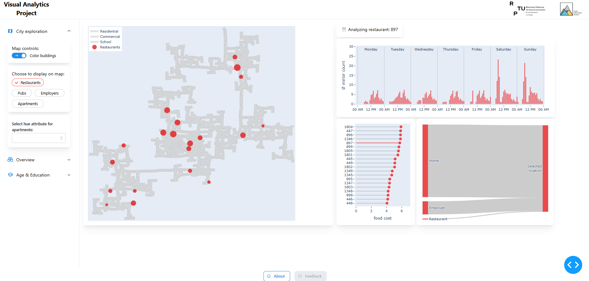

### Dash App for VAST Challenge 2022 Visualization

### 📖 Overview

This Dash application is designed to visualize and analyze data from the [VAST Challenge 2022](https://vast-challenge.github.io/2022/index.html). The application provides interactive charts and maps to explore various aspects of the city, including restaurants, pubs, residential areas, and more.

### 🛠️ Prerequisites

-   Python 3.10
-   Virtual environment (optional but recommended)

### 📦 Installation

1.  Clone the repository or download the project files.
2.  Navigate to the project directory.
3.  Install the required dependencies:

```bash
pip install -r requirements.txt
```

### 🚀 Running the App

1.  Open a terminal and navigate to the project directory.
2.  Run the application with:

```bash
python dash_app.py
```
3. Unpack ``resources.zip`` in resources  
4.  Open your browser and go to [http://localhost:8080](http://localhost:8080/).

### 🖼️ Application Features

-   **Interactive Map**: Explore different city components like restaurants, pubs, apartments, and employers.
-   **Charts and Graphs**: Analyze visitor frequencies, financial statuses, and job switching trends.
-   **Customizable Display**: Toggle different layers and filters for better insights.


### 🗂️ Directory Structure
```
.
├── dash_app.py
├── [...Python files for domain-specific logic like Apartment, Building, etc.]
├── requirements.txt
├── resources
    └── resources.zip [unpack data files here]
    └── assets
        └── RPTU_Logo.png
		└── ...
        └── VIA-Logo.svg
```

### 🌐 Additional Resources
-   [Project Website](https://vast-challenge.github.io/2022/index.html)
-   [University Chair](https://vis.cs.rptu.de/)
